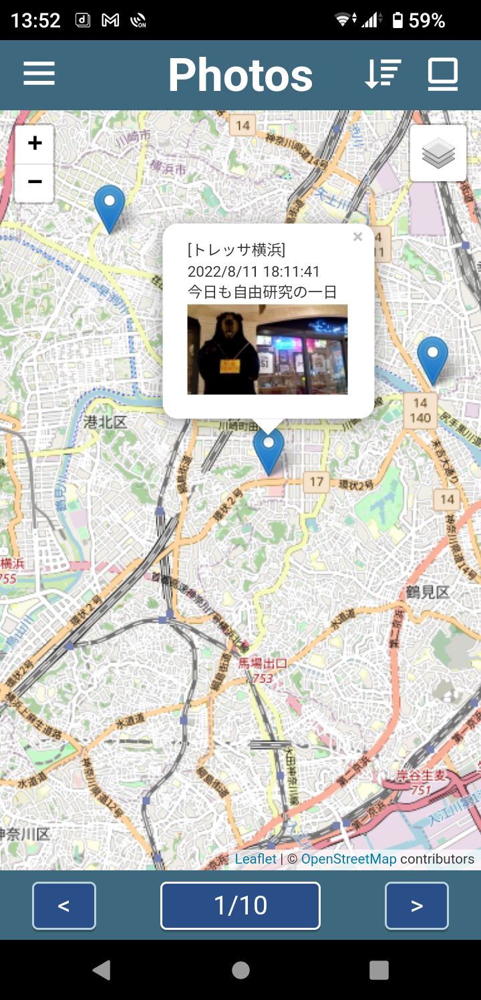

# My Photos: React-SpringBoot-Salesforce integration

I have been enjoying this app over a half year in my free time.

Unfortunately, [this announcement](https://blog.heroku.com/next-chapter) made me sad.

I leave "heroku-connect" branch intact and switch back to "main" branch.

I am working on remaking this to exclude the Heroku part (the API server backend implemented on SpringBoot, and Heroku Connect) from this project:
- Replace "PhotoViewer" LWC with "ImageViewer" LWC to view an attached image file to Record__c object.
- Add JS APIs for the React frontend to work with REST API to access the custom objects (Record__c) on Salesforce platform.

---
<table>
  <tr>
    <td valign="top"></td>
    <td valign="top"></td>
  </tr>
</table>

## Goals

- Mobile photo app based on React and SpringBoot/Heroku for cycling and walking on weekends
- Integration with Salesforce via Heroku Connect to privide rich UIs for desktop

#### TODO

- OAuth2.0 support -- https://trailhead.salesforce.com/ja/content/learn/projects/build-a-connected-app-for-api-integration
- Lifecycle management based on SFDX -- https://github.com/forcedotcom/df17-ant-to-sfdx, https://www.youtube.com/watch?v=WX4urLYi7dA

## Components

- A custom object "record__c" on Salesforce Platform
- React-based mobile app (frontend)
- SpringBoot-based REST API service with PostgreSQL (backend)
- Heroku Connect for synchronizing data between Heroku and Salesforce Platform
- Lightning Web Components to privide rich UIs for desktop

## Architecture

```
                            Table <- - - - - in sync - - - - -> Custom object
[Mobile app]---REST---[REST API service]---Heroku Connect---[APEX backend scripts]---[LWC frontend]
  React                SpringBoot/Heroku                     Salesforce Platform      Web components

```

## Projects

- Salesforce: [myphotos](./myphotos) (LWC components in this project)
- SpringBoot: [spring-myphotos](https://github.com/araobp/spring-myphotos) on "heroku-connect" branch
- React: [react-myphotos](https://github.com/araobp/react-myphotos) on "heroku-connect" branch

#### Original LWC components in this project

- [pictureMap](./myphotos/myphotos/main/default/lwc/pictureMap)
- [picturesMap](./myphotos/myphotos/main/default/lwc/picturesMap)
- [photoViewer](./myphotos/myphotos/main/default/lwc/photoViewer)


<table>
  <tr>
    <td valign="top"></td>
    <td valign="top"></td>    
  </tr>
</table>

#### CSP setting

The "[PhotoViewer](./myphotos/myphotos/main/default/lwc/photoViewer)" LWC component issues a HTTP GET from JavaScript to MyPhotos REST API service hosted by the Heroku instance.

CSP setting is required for such as access:


## References
- [Using Leaflet to show maps in your LWC components](https://sonneiltech.com/2021/01/using-leaflet-to-show-maps-in-your-lwc-components/)
- [Develop Against Any Org](https://developer.salesforce.com/docs/atlas.en-us.238.0.sfdx_dev.meta/sfdx_dev/sfdx_dev_develop_any_org.htm)
