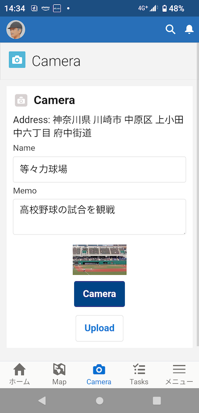
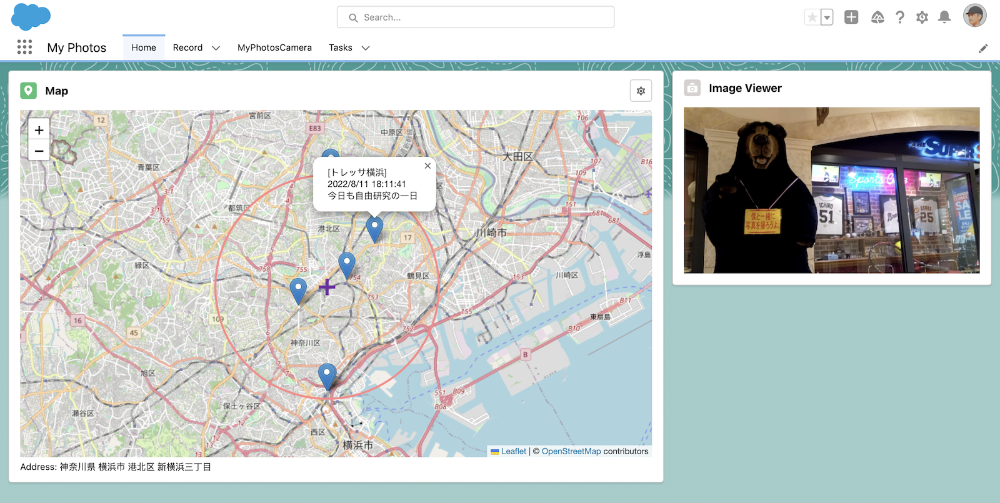
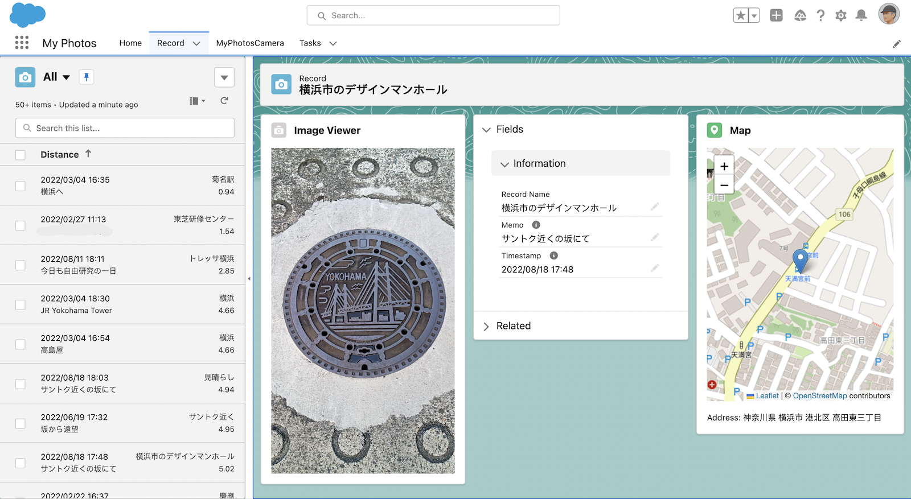
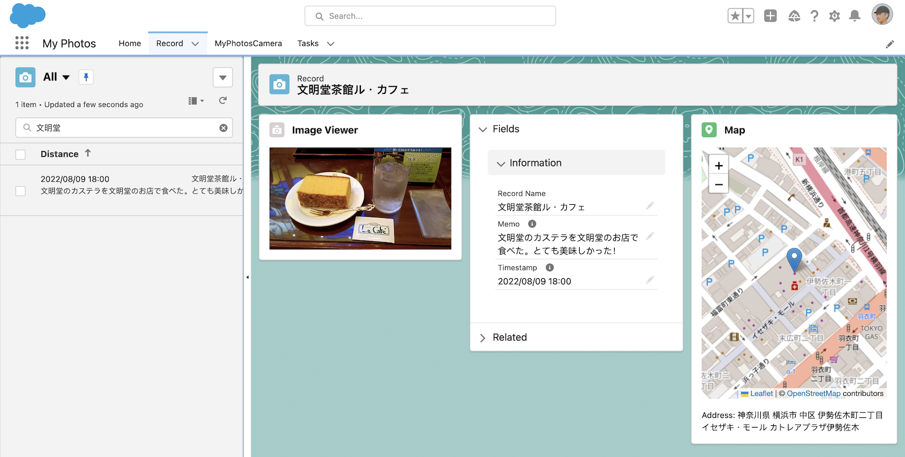
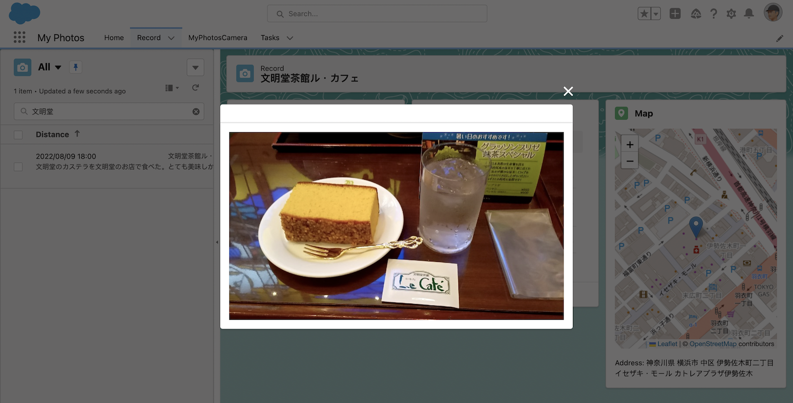
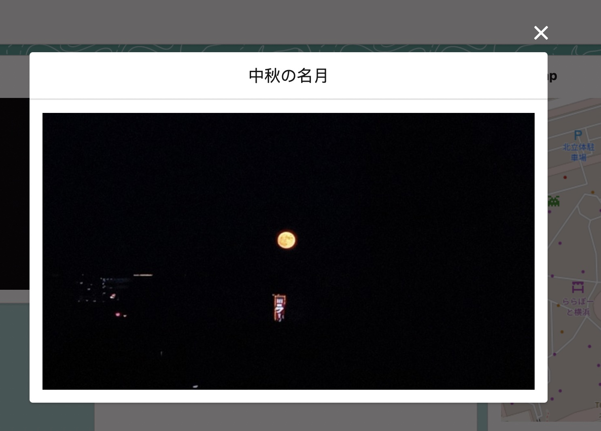
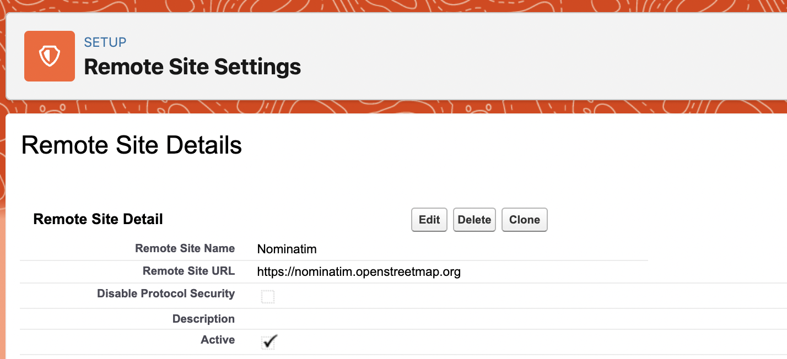
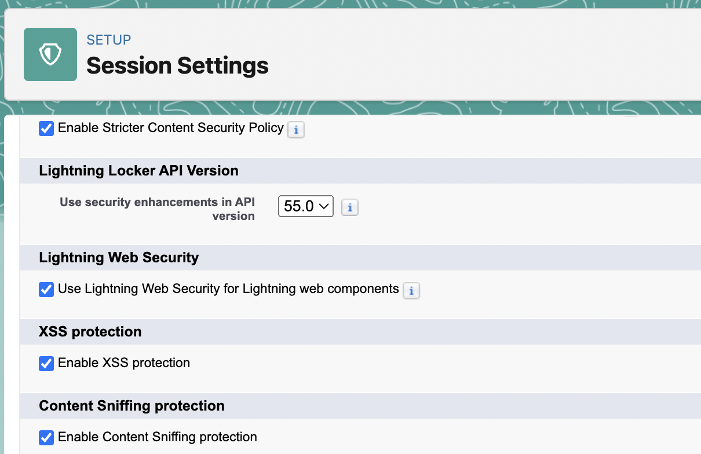

# My Photos

セールスフォース開発者エディション(無償)でつくる写真アプリ

当プロジェクトでは、Salesforceの開発者エディション（無償）で写真アプリをつくります。位置情報と紐づけたメモ付き写真記録を行えるところが、ここで開発する写真アプリの特徴です。以下、簡単に、このアプリの用途や目標を述べます。

- 私は、このアプリを、私の週末の活動、買い物、散歩やサイクリングで利用しています。
- 基本的には写真記録アプリなのですが、Salesforce的な要素を多分に取り入れております。例えば、「次にあのスーパーへ行ったら、これを買おう」みたいなタスクを登録しておき、そのスーパーへ行った時にこのアプリを起動すると、タスク一覧が表示されます。
- このアプリを利用しながら継続的な改善を継続し、使い勝手が向上しつつあります。
- 現在はRelease 1.0の開発中（最終段階）ですが、Release 2.0ではAR(Unityでフロントエンド、Salesforceでバックエンド開発)と連携させた空間情報と紐づける予定です。

【注意】 本プロジェクトの成果は週末の私の趣味として開発したもので、私の仕事とは一切関係ありません。

## ドキュメント

- [概要設計書　Release 1.0](https://docs.google.com/presentation/d/e/2PACX-1vThFeg9FeNg4kEuNcWNcRyY2i67ijAPIiIBs82b_zYlq_BmLSSwvneXUAh5Sk-sQN7y7K5qXxb4oewN/pub?start=false&loop=false&delayms=3000)
- [マニュアル Release 1.0] ... 作成中

## リリース予定

- 2022年8月より開発開始。2022年12月までに未管理パッケージとしてRelease 1.0をリリース予定。LeafletとGSPによる測位と位置表現。iOS/Androidのネイティブカメラアプリによる写真撮影。
- 2023年以降は屋内位置情報を3D座標で取り扱うため、AR(Unity)と組み合わせた空間情報まで領域を広げる予定。
-- スーパーなどの特定の場所で、その場所内のポスターやQRコードをARアンカーとし、それを基準点とした屋内測位を行ったり、特定の3D位置へARマーカーを付与する。

<hr>

Salesforce Developer Edition could be a great low-code development platform for Sunday programmers.

And the size of storage (5MB data storage and 20MB file storage) is large enough for storing a few hundreds of low-resolution photo images.

This project is to develop a mobile photo app based on Salesforce Platform (i.e., Salesforce Platform license is assigned to the users).

- Use navigator.geolocation for geolocation (GPS).
- Use HTML input element to capture image from a mobile camera app.
- Use Task object for location-based task reminder.

## Deployment instruction

This project has developed an unmanaged package "myphotos" with "Salesforce Platform" license.

Just deploy it to your salesforce platform by VSCode or SFDX CLI.

Then create a user with "Salesforce Platform" license with "Standard Platform User" profile, then assign a permission sets "MyPhotos" to the user.

That's it!

## Data model

This application uses the following objects and fields:

- "Record__c" custome object for text data of every photo images
- "Place__c" custom object for places I often go
- "Geolocation__c" custome field in "User" standard object for my current location
- "Content Version", "ContentDocument" and "ContentDocumentLink" for photo images


## Components

#### Camera for smart phone

This app makes use of a native mobile camera app via HTML input element:

```
      <label class="slds-button slds-button_brand">
        <input style="display: none;" class="slds-col slds-p-around_small" type="file" accept="image/*"
          capture="environment" onchange={handleCapture} />
        Camera
      </label>
```



#### Home page for desktop



#### Record page for desktop



#### Image viewer

<table>
  <tr>
    <td valign="top">
    <td valign="top"></td>
    <td valign="top"></td>
  </tr>
</table>

## Architecture

```
                                Record__c custom object
   [LWC components]-------------[APEX backend scripts]
    Web components               Salesforce Platform

```

#### Original LWC components in this project

- [pictureMap](./myphotos/myphotos/main/default/lwc/pictureMap)
- [picturesMap](./myphotos/myphotos/main/default/lwc/picturesMap)
- [imageViewer](./myphotos/myphotos/main/default/lwc/imageViewer)
- [camera](./myphotos/myphotos/main/default/lwc/camera)
- [gps](./myphotos/myphotos/main/default/lwc/gps) (GPS library, not LWC component)

## Distance caliculation for each record of "Record__c"

I added a custom field "Geolocation__c" to "User" standard object.
Then I added a custom formula field "Distance__c" to "Record__c":

```
Distance(Geolocation__c, $User.Geolocation__c, 'km')
```

## Remote site settings

[NominatimCallout](./myphotos/myphotos/main/default/classes/NominatimCallout.cls) Apex script assumes a remote site setting as follows:



## Lightning Web Security (LWS)

Although this project does not use HTML5 webcam capability, this is just a note for future extensions of this project.

It is necessary to enable LWS to use navigator.mediaDevices.getUserMedia() to capture image from Mac and PC (its security protected by LWS).



## Images saved as Salesforce Files (ContentDocument/ContentVersion)

Images captured by a mobile camera are saved as Salesforce Files.

[Reference] https://qiita.com/panxl/items/c8a4d5ffe7fe92f6a3ab


## References
- [Using Leaflet to show maps in your LWC components](https://sonneiltech.com/2021/01/using-leaflet-to-show-maps-in-your-lwc-components/)
- [Nominatim](https://nominatim.org/)
- [Custom File Upload Using LWC](https://www.salesforcetroop.com/custom_file_upload_using_lwc)
