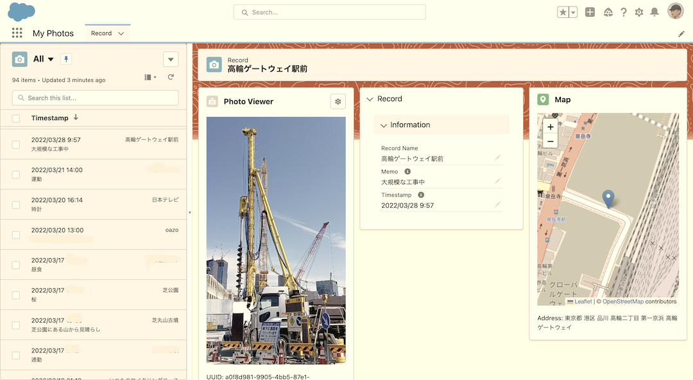
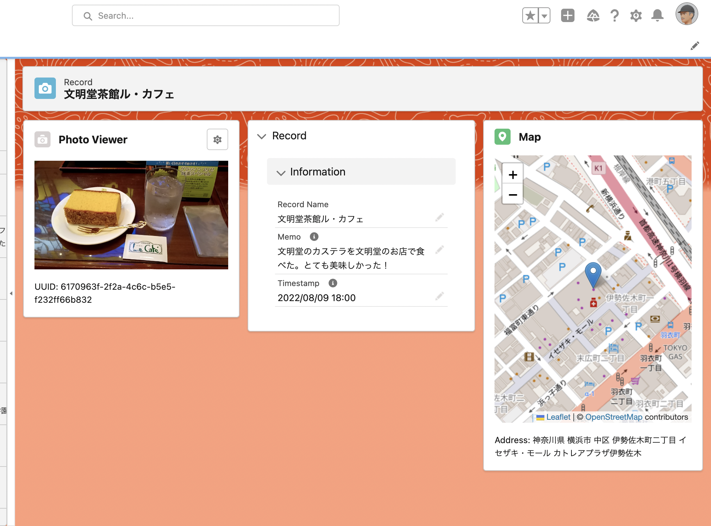
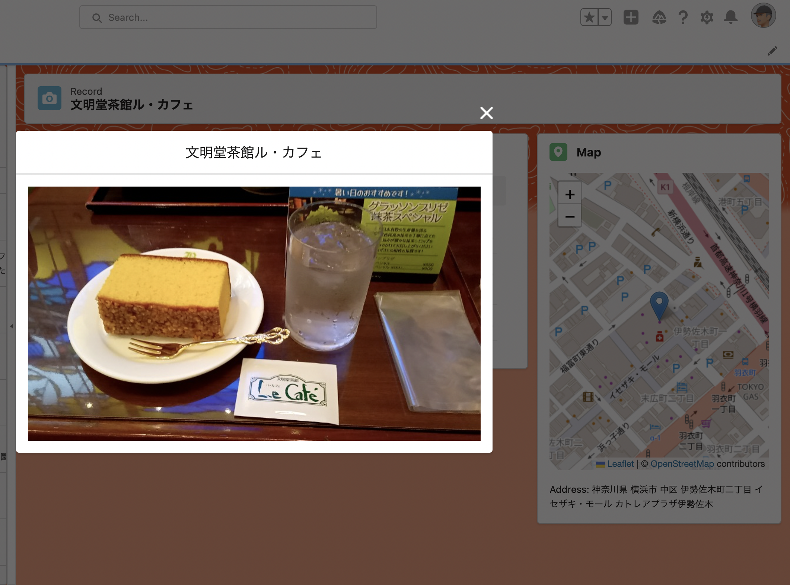
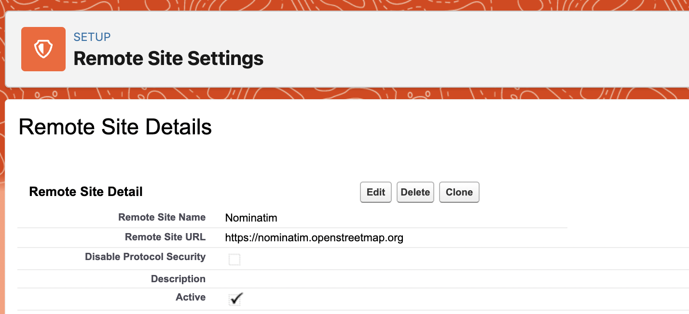
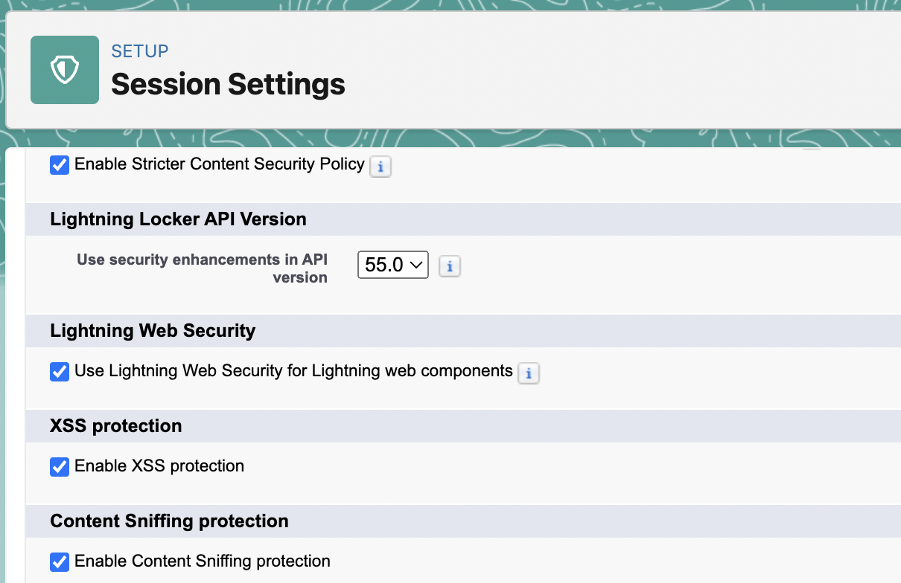

# My Photos

Salesforce Developer Edition could be a great low-code development platform for Sunday programmers.

And the size of storage (5MB data storage and 20MB file storage) is large enough for storing a few hundreds of low-resolution photo images.

This project is to develop a mobile photo app based on Salesforce Platform.

- Use navigator.geolocation for geolocation (GPS).
- Use navigator.mediaDevices.getUserMedia() to capture image from Mac and PC (its security protected by LWS).
- Use HTML input element to capture image from a mobile camera.

#### Home page


#### Record page



## Architecture

```
                                Record__c custom object
   [LWC components]-------------[APEX backend scripts]
    Web components               Salesforce Platform

```

#### Original LWC components in this project

- [pictureMap](./myphotos/myphotos/main/default/lwc/pictureMap)
- [picturesMap](./myphotos/myphotos/main/default/lwc/picturesMap)
- [imageViewer](./myphotos/myphotos/main/default/lwc/imageViewer)
- [camera](./myphotos/myphotos/main/default/lwc/camera)
- [gps](./myphotos/myphotos/main/default/lwc/gps) (GPS library, not LWC component)

<table>
  <tr>
    <td valign="top">
    <td valign="top"></td>    
  </tr>
</table>

## Distance caliculation for each record of "Record__c"

I added a custom field "Geolocation__c" to "User" standard object.
Then I added a custom formula field "Distance__c" to "Record__c":

```
Distance(Geolocation__c, $User.Geolocation__c, 'km')
```

## Remote site settings

[NominatimCallout](./myphotos/myphotos/main/default/classes/NominatimCallout.cls) Apex script assumes a remote site setting as follows:



## Lightning Web Security (LWS)

Although this project does not use HTML5 webcam, this is a note for enable webcam on LWC.

Enable LWS (Lightning Web Security) to enable "navigator.mediaDevices.getUserMedia()" (to enable WebCam).



## References
- [Using Leaflet to show maps in your LWC components](https://sonneiltech.com/2021/01/using-leaflet-to-show-maps-in-your-lwc-components/)
- [Develop Against Any Org](https://developer.salesforce.com/docs/atlas.en-us.238.0.sfdx_dev.meta/sfdx_dev/sfdx_dev_develop_any_org.htm)
- [Nominatim](https://nominatim.org/)
- [Custom File Upload Using LWC](https://www.salesforcetroop.com/custom_file_upload_using_lwc)
