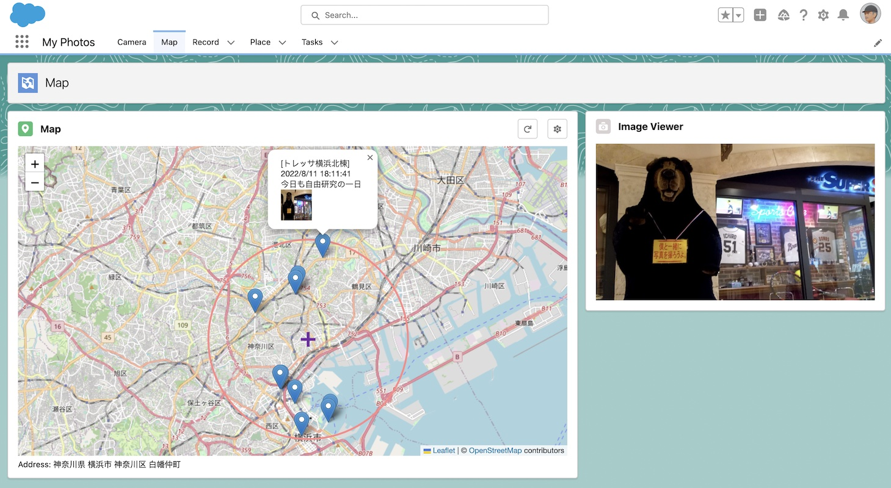
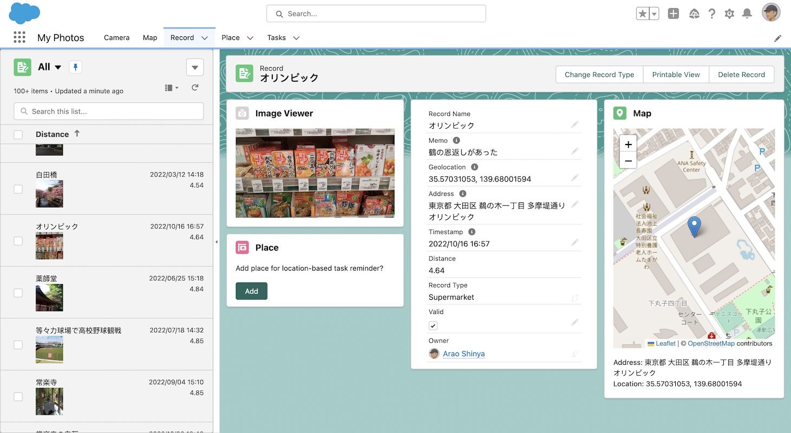
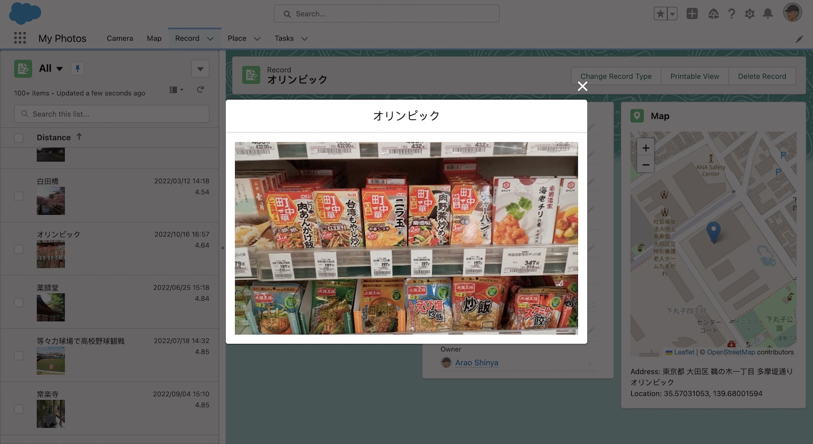
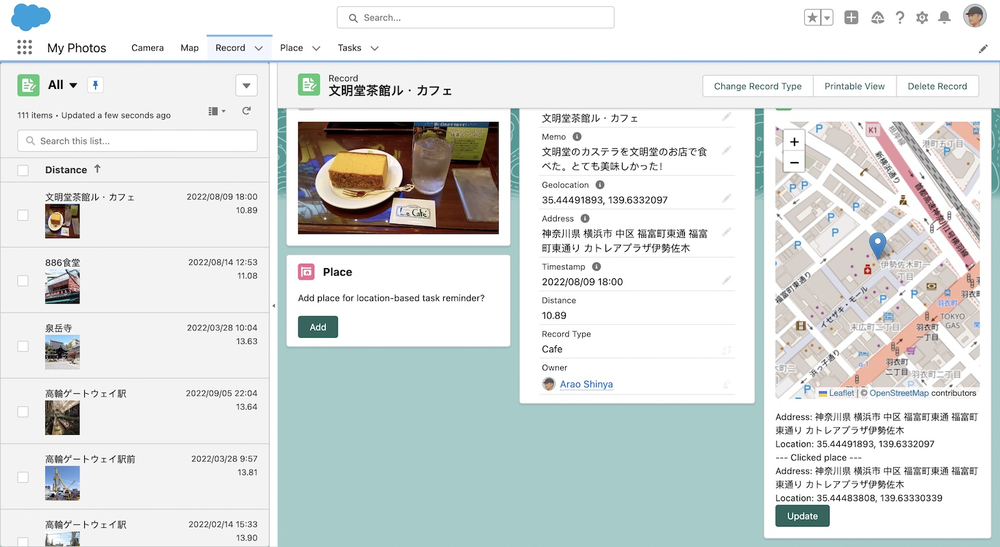
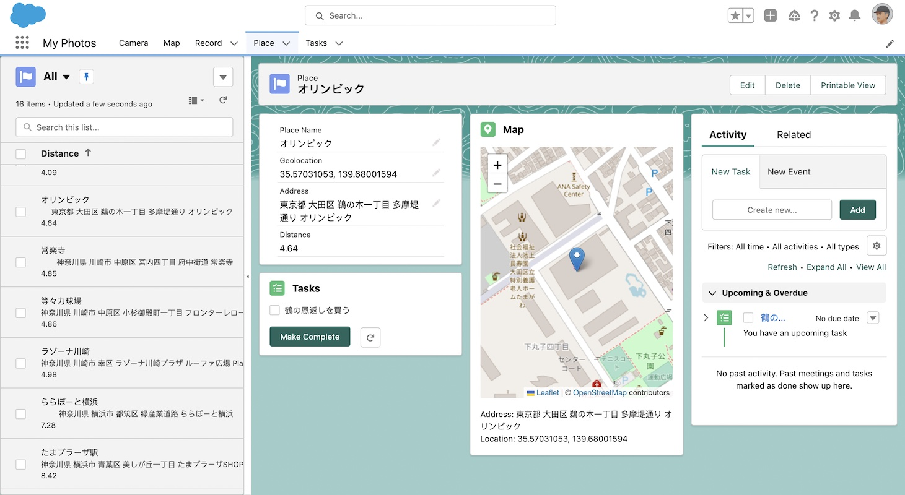

# My Photos

## セールスフォース開発者エディション(無償)でつくる写真記録アプリ

当プロジェクトでは、Salesforce Platformによるアプリ開発を勉強するため、Salesforce開発者エディション（無償）で写真記録アプリをつくります。位置情報と紐づけたメモ付き写真記録を行えるところが、ここで開発する写真アプリの特徴です。また、このアプリをスマホからも利用出来る様にします。

以下、簡単に、このアプリの用途を述べます：

- 私は、このアプリを、私の週末の活動、買い物、散歩やサイクリングで利用しています。スマホへSalesforceアプリ(Salesforce for Android/iOS)を入れておき、その上で、このアプリを利用しています。
- 基本的には写真記録アプリなのですが、Salesforce的な要素を取り入れております。例えば、「次にあのスーパーへ行ったら、これを買おう」みたいなタスクを登録しておき、そのスーパーへ行った時にこのアプリを起動すると、タスク一覧が表示されます。

## 動作環境

- IEを除く主要ブラウザ
- [Salesforce for Android](https://play.google.com/store/apps/details?id=com.salesforce.chatter&hl=ja&gl=US)
- [Salesforce for iOS](https://apps.apple.com/jp/app/salesforce/id404249815)

## 未管理パッケージとしてアプリ配布

本プロジェクトの成果はSalesforceへ未管理パッケージとしてupload済み (2022/10/29 ver1.2)

[未管理パッケージとしてインストール](https://login.salesforce.com/packaging/installPackage.apexp?p0=04t5i000000Z5f6)

## ドキュメント

- [概要設計書 Version 1.2](https://docs.google.com/presentation/d/e/2PACX-1vThFeg9FeNg4kEuNcWNcRyY2i67ijAPIiIBs82b_zYlq_BmLSSwvneXUAh5Sk-sQN7y7K5qXxb4oewN/pub?start=false&loop=false&delayms=3000)
- [操作説明書 Version 1.2](https://docs.google.com/presentation/d/e/2PACX-1vRNwhvAk96R3S2uTnIcaJVKwjwNRoVct1j8sBk_C1bhSxcIQo_2y30YyBoz2ChGJHIPT8knqO7hthz9/pub?start=false&loop=false&delayms=3000)

## スクリーンショット（Desktop)

#### Mapタブ

#### Recordタブ

#### Recordタブで写真拡大表示

#### Recordタブの地図上でマーカー位置を微調整

#### Placeタブ

## スクリーンショット（Smart phone)

(...)

## 今後の開発計画

- Version 2: Experience Cloudで写真記録の一部を外部公開 (2023年開発予定)

## 参考

- [Using Leaflet to show maps in your LWC components](https://sonneiltech.com/2021/01/using-leaflet-to-show-maps-in-your-lwc-components/)
- [Nominatim](https://nominatim.org/)
- [Custom File Upload Using LWC](https://www.salesforcetroop.com/custom_file_upload_using_lwc)
