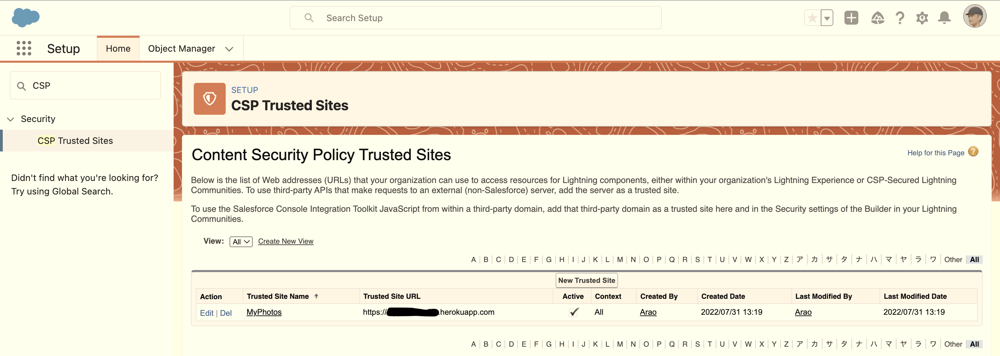

# My Photos: React-SpringBoot-Salesforce integration

<table>
  <tr>
    <td valign="top"></td>
    <td valign="top"></td>
  </tr>
</table>

## Goals

- Mobile photo app based on React and SpringBoot/Heroku for my weekend cycling
- Integration with Salesforce via Heroku Connect to privide rich UIs for desktop

#### TODO

- OAuth2.0 support

## Components

- A custom object "record__c" on Salesforce Platform
- React-based mobile app (frontend)
- SpringBoot-based REST API service with PostgreSQL (backend)
- Heroku Connect for synchronizing data between Heroku and Salesforce Platform
- Lightning Web Components to privide rich UIs for desktop

## Architecture

```
                            Table <- - - - - in sync - - - - -> Custom object
[Mobile app]---REST---[REST API service]---Heroku Connect---[APEX backend scripts]---[LWC frontend]
  React                SpringBoot/Heroku                     Salesforce Platform      Web components

```

## Projects

- Salesforce: [myphotos](./myphotos) (LWC components in this project)
- SpringBoot: [spring-myphotos](https://github.com/araobp/spring-myphotos) on "heroku-connect" branch
- React: [react-myphotos](https://github.com/araobp/react-myphotos) on "heroku-connect" branch

#### Original LWC components in this project

- [pictureMap](./myphotos/force-app/main/default/lwc/pictureMap)
- [picturesMap](./myphotos/force-app/main/default/lwc/picturesMap)
- [photoViewer](./myphotos/force-app/main/default/lwc/photoViewer)


#### CSP setting

The "[PhotoViewer](./myphotos/force-app/main/default/lwc/photoViewer)" LWC component issues a HTTP GET from JavaScript to MyPhotos REST API service hosted by the Heroku instance.

CSP setting is required for such as access:



## References
- [Using Leaflet to show maps in your LWC components](https://sonneiltech.com/2021/01/using-leaflet-to-show-maps-in-your-lwc-components/)
